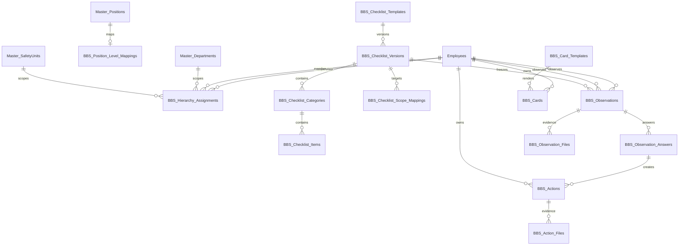

# BBS Smart Card — Phase 0 Discovery and Design

วันที่สำรวจ: 25 สิงหาคม 2026
สถานะ: **Phase 0 อนุมัติแล้ว — พร้อมเริ่ม Phase 1 เมื่อมีคำสั่ง implementation; ยังไม่มี application/schema/data/Production mutation**

## 1. Executive conclusion

ระบบเดิมรองรับการเริ่มพัฒนา BBS Smart Card ได้โดย reuse `Employees`,
`Master_Departments`, `Master_SafetyUnits`, `Master_Positions`, JWT, upload,
audit และรูปแบบ Node/PHP parity เดิม แต่ข้อมูลปัจจุบันยังไม่เพียงพอสำหรับ
คำนวณสายบังคับบัญชา BBS อย่างปลอดภัย

ข้อสรุปหลัก:

- ใช้ `Employees.EmployeeID` เป็น identity เดิมต่อไป รองรับทั้งเลข 6 หลักและ
  รหัสที่มีตัวอักษร
- ห้ามนำ `Employees.Role` ไปแทน BBS level เพราะ global role มีเพียง
  `Admin`, `User`, `Viewer`
- ต้องมี BBS-specific position mapping และ effective-dated hierarchy
  assignment โดยอ้างอิง Master เดิม ไม่สร้าง Employee/Department/Unit ซ้ำ
- `Employees.Team` ยังใช้เป็น source of truth ไม่ได้ เพราะมีข้อมูลเพียง 1 คน
- ยังไม่มีแหล่งข้อมูลกลางสำหรับ active/inactive/leave และรูปพนักงาน
- ข้อมูล Unit ที่มีอยู่จับคู่ Master ได้ แต่มีเฉพาะ 367 จาก 2,492 คน จึงต้อง
  กำหนด fallback และทำ readiness check ก่อนเปิด pilot
- QR ต้องเป็น opaque, revocable locator และไม่ใช่ credential

คำแนะนำ MVP คือทำ Phase 1–3 โดยยังไม่เปิด QR, batch card printing,
notification จริง หรือ ranking รายบุคคล จนกว่า hierarchy และ privacy policy
ผ่านการยืนยัน

## 2. Scope and method

Phase 0 ใช้วิธี read-only เท่านั้น:

- อ่าน architecture, route และรูปแบบ integration ของ SPA, Node และ PHP
- ตรวจ schema และ aggregate data จากฐานข้อมูล Local snapshot
- ไม่อ่าน/แสดง password, token หรือข้อมูลพนักงานรายบุคคลในรายงาน
- ไม่แก้ application code, schema, business data หรือ Production

ผลเชิงปริมาณในเอกสารนี้เป็น Local snapshot ณ วันที่สำรวจ ไม่ถือเป็นยอด
Production แบบ real-time ก่อน migration ต้องทำ Production preflight แบบ
read-only ซ้ำอีกครั้ง

## 3. Existing-system discovery

### 3.1 Sources that can be reused

| Domain | Existing source | Decision |
|---|---|---|
| Employee identity | `Employees.EmployeeID` | Reuse; ห้ามสร้าง BBS employee master |
| Employee profile | `EmployeeName`, `Department`, `Unit`, `Position` | Reuse พร้อม snapshot ตอน submit |
| Department | `Master_Departments` | Source of truth |
| Safety Unit | `Master_SafetyUnits.department_id` | Source of truth เมื่อ employee มี Unit |
| Position | `Master_Positions` | Reuse ผ่าน Admin-configured BBS mapping |
| Authentication | JWT และ middleware เดิม | Reuse; QR ไม่ login แทนผู้ใช้ |
| Global authorization | `Admin/User/Viewer` | คงเดิม ไม่เพิ่ม BBS level เป็น Role |
| Upload | storage/upload middleware เดิม | Reuse พร้อม object-level read permission |
| Audit | Admin audit pattern เดิม | Reuse สำหรับ config, publish, issue/revoke, export |
| Email/alert | SMTP/outbox/dashboard alert pattern | สำรวจซ้ำก่อน Phase 5; ไม่สร้าง framework ใหม่ทันที |
| SPA shell | `index.html`, `main.js`, `module-meta.js` | เพิ่ม route ใน Phase 3 เท่านั้น |

Admin organization APIs เดิมมี Department และ Safety Unit CRUD อยู่แล้ว
ดังนั้น BBS configuration ต้องอ้างอิง ID จาก API เหล่านี้ ไม่ hardcode รายชื่อ
แผนกหรือ Unit

### 3.2 Local data audit

| Check | Result | Impact |
|---|---:|---|
| Employees | 2,492 | เพียงพอสำหรับ pilot หลัง hierarchy readiness |
| Numeric 6-digit IDs | 1,545 | ต้องเก็บ ID เป็น string เพื่อรักษาเลขศูนย์นำหน้า |
| Letter-prefix IDs | 947 | validation ห้ามบังคับ numeric-only |
| Missing employee name | 0 | ผ่าน |
| Missing Department | 0 | ผ่าน แต่มี control character บางแถว |
| Missing Unit | 2,125 | Unit ใช้เป็น required scope ทั้งบริษัทไม่ได้ในทันที |
| Missing Team | 2,491 | ห้ามใช้ Team คำนวณ BBS hierarchy |
| Missing Position | 0 | เหมาะกับ position mapping |
| Departments / active | 41 / 41 | Reuse ได้ |
| Safety Units | 26 | Reuse ได้ในแผนกที่มี mapping |
| Positions | 23 | ต้อง mapping เป็น BBS level โดย Admin |
| Master Teams | 7 | ยังไม่สัมพันธ์กับ employee data เพียงพอ |
| Department mismatch | 8 | พบ `OUT SOURCE`/`OUTSOURCE SEC.` ที่มี CR แฝง |
| Position mismatch | 1 | `วิศวกรอาวุโส` ไม่มีใน Master |
| Nonblank Unit mismatch | 0 | Unit ที่มีข้อมูลจับคู่ Department master ได้ |

Role distribution คือ User 2,486, Admin 3 และ Viewer 3 ยืนยันว่า Role เดิม
ไม่ใช่ organization hierarchy

### 3.3 Important gaps

1. `Employees` ไม่มี `SupervisorEmployeeID` หรือ reporting line
2. ไม่มี employee active/inactive/termination/leave source แบบส่วนกลาง
3. ไม่มี employee photo source แบบส่วนกลาง
4. รูปใน `forklift_employee_photos` เป็นข้อมูลเฉพาะ Forklift และไม่ควรถูกใช้
   ข้ามโมดูลโดยอัตโนมัติ
5. `Master_Positions.IsSupervisorPatrol` เป็นกติกาเฉพาะ Patrol ไม่ใช่ BBS
6. logical references ของ Master หลายจุดไม่ได้บังคับด้วย database FK
7. Department บางแถวมี CR/LF แฝง ต้อง normalize/clean ผ่านงานข้อมูลที่
   อนุมัติแยกต่างหาก ห้าม bulk-replace ใน Phase 0

## 4. Approved assumptions and phased decisions

### Safe defaults proposed

- BBS level เป็น module-level attribute ไม่ใช่ global role
- หากไม่มี Unit ให้ fallback เป็น Department เฉพาะเมื่อ Admin ตั้ง scope นั้น
  อย่างชัดเจน ไม่เดาอัตโนมัติ
- hierarchy ใช้ effective dates และเก็บ history ห้าม overwrite assignment เดิม
- KPI รอบแรกเสนอ monthly target พร้อม annual roll-up
- ไม่มี observation ให้ถือว่า `Not started`; ห้ามตีความเป็นลางาน
- สถานะเทาใช้ได้เฉพาะ `Exempt/Unavailable` ที่มีเหตุผลและ audit
- action รอบแรกเป็น BBS-owned action เพื่อไม่ผูก lifecycle กับโมดูลอื่น
- checklist conflict ต้อง fail closed และแจ้ง Admin

### Approved baseline for Phase 1

เจ้าของระบบอนุมัติเมื่อ 25 สิงหาคม 2026:

1. พนักงาน → Operator, หัวหน้ากลุ่ม → Group Leader, หัวหน้าแผนก →
   Department Head, หัวหน้าส่วน → Section Head และผู้จัดการ → Manager;
   Position ย่อยต้องผ่าน Admin-reviewed mapping ก่อนเปิดใช้งาน
2. Group Leader สังเกต Operator ภายใน Unit ที่ได้รับมอบหมาย; server เป็นผู้
   resolve scope และ frontend ไม่มีสิทธิ์ขยายรายชื่อ
3. Group Leader ต้องมี submitted observation อย่างน้อย 1 ครั้งต่อวันจันทร์–
   ศุกร์ ตาม `Asia/Bangkok`; Draft ไม่นับ และยังไม่หักวันหยุดบริษัทจนกว่าจะมี
   calendar source ที่อนุมัติ
4. Operator เห็นเฉพาะรายการที่ตนเป็นผู้ตรวจหรือผู้ถูกตรวจ; การเห็นชื่อ
   observer, Unsafe history และข้อมูลรายบุคคลระดับหัวหน้าจำกัดอยู่ภายใน
   Department ของตน; Admin เห็นทั้งหมดและ detail access ต้อง audit ได้
5. Pilot คือ Department `MAINTENANCE SEC.` / Safety Unit `Tube Cutting` และ
   configuration ต้องอ้าง Master Data ID ไม่ hardcode ชื่อ

### Decisions deferred to their owning phases

- Phase 2: Unsafe item ใดบังคับ remark/photo/action
- Phase 4: Card dimensions, printed EmployeeID policy และ QR expiry/rotation
- Phase 5: action owner/verifier, reopen permission และ SLA

Phase 1 ต้องออกแบบ settings ให้รองรับการกำหนดค่าเหล่านี้ภายหลัง แต่ห้ามสร้าง
workflow ของ Phase 2, 4 หรือ 5 ล่วงหน้า

## 5. BBS level and permission model

ระบบ resolve สิทธิ์จาก `global role + BBS level + active assignment + effective
date + configured scope` ทุกครั้งที่ server ห้ามเชื่อ list จาก frontend

| ลำดับ | ตำแหน่งหลัก | BBS level |
|---:|---|---|
| 1 | พนักงาน | Operator |
| 2 | หัวหน้ากลุ่ม | Group Leader |
| 3 | หัวหน้าแผนก | Department Head |
| 4 | หัวหน้าส่วน | Section Head |
| 5 | ผู้จัดการ | Manager |

ตารางนี้เป็น hierarchy ที่เจ้าของระบบอนุมัติแล้ว ส่วน Position อื่นที่พบใน
Master เช่นสายวิชาชีพหรือระดับอาวุโสต้อง map เข้าหนึ่งในห้าระดับด้วยการ review
ของ Admin ไม่ใช้การจับคำอัตโนมัติ

| Actor | Observe | Read detail | Configure |
|---|---|---|---|
| Operator | Peer ใน scope ที่อนุมัติ | ของตนเองตาม privacy policy | ไม่มี |
| Group Leader | Operator ใน assignment | ทีมที่รับผิดชอบ | ไม่มี |
| Department Head | Group Leader ใน assignment | scope ที่รับผิดชอบ | ไม่มี |
| Section Head | Department Head ใน assignment | scope ที่รับผิดชอบ | ไม่มี |
| Manager | Section Head ใน assignment | scope ที่รับผิดชอบ | ไม่มี |
| Viewer | ไม่ได้โดย default | aggregate ที่อนุมัติ | ไม่มี |
| Admin | ทุก scope ผ่าน Admin flow | ทั้งบริษัท | mapping/template/card/settings |

ทุก detail/file endpoint ต้องตรวจ object-level permission ใหม่ ไม่อนุญาตเพียง
เพราะผู้ใช้เดา ID ของ observation หรือไฟล์ได้

## 6. Proposed architecture

```text
Existing SPA (#bbs-smart-card)
        |
        v
public/js/api.js + TSHSession + existing UI utilities
        |
        +--> Node local: /api/bbs/*
        +--> PHP Production compatibility: /api/bbs/*
                         |
                         v
              Shared rule fixtures/parity tests
                         |
          Existing Masters + BBS-owned tables
                         |
          Existing uploads + Admin audit/outbox
```

Business rules ที่ต้องมีผลตรงกันทั้ง Node/PHP ได้แก่ scope resolution,
checklist resolution, transition, KPI formula และ QR lifecycle ใช้ fixture
เดียวกันในการทดสอบ parity

## 7. ERD draft



### Table design decisions

- `BBS_Position_Level_Mappings`: PositionID unique, BBSLevel, IsActive,
  effective/audit fields
- `BBS_Hierarchy_Assignments`: SupervisorEmployeeID, MemberEmployeeID,
  DepartmentID, optional SafetyUnitID, assignment type, EffectiveFrom/To,
  IsActive, reason and audit fields; unique active-overlap must be validated in
  transaction because MySQL constraints alone cannot express date overlap
- checklist version rows become immutable after publish
- observation stores EmployeeID references plus name/Department/Unit/Position
  snapshots to preserve historical reporting after transfers
- QR token is stored as a unique cryptographic hash; raw token appears only in
  the generated URL and must never be logged
- use existing Admin audit log unless retention/access requirements prove a
  BBS-specific audit table is necessary
- do not create aggregate report tables until measured query performance
  justifies them

## 8. Checklist resolution algorithm

1. Server verifies observer-to-observed permission.
2. Load observed employee and effective BBS context.
3. Select only published/active versions effective at observation time.
4. Filter scope mappings that match Department, optional Unit, Position and
   BBS level.
5. Score specificity in this order: exact Unit + Position + Level, exact Unit,
   exact Department + Position/Level, Department, company default.
6. Pick highest specificity, then explicit priority, then latest effective
   version.
7. If top candidates still tie, return a configuration conflict and do not
   create/submit an observation.
8. Store selected version, resolution reason and organization snapshot.

ไม่พบ checklist ให้ fail closed พร้อมข้อความติดต่อ Admin ห้ามให้ผู้ใช้เลือก
template เองเพื่อข้าม configuration

## 9. API contract draft

ทุก response ใช้ shape เดิม `{ success, data, message }` และทุก list มี
pagination/filter/sort whitelist

| Group | Proposed endpoints | Permission |
|---|---|---|
| Context | `GET /api/bbs/me/context`, `/me/team`, `/eligible-employees` | Auth + resolved scope |
| Checklist | `GET /checklists/resolve`, Admin CRUD/version/publish/preview | Resolve scoped; writes Admin |
| Observation | `POST /observations/draft`, `PUT /observations/:id`, `POST /:id/submit`, history/detail | Object-level |
| Evidence | observation/action upload, read, delete endpoints | Object-level + secure upload |
| Action | list/detail/transition/verify/reopen | Owner/verifier/Admin transition rules |
| Dashboard | personal/team/company summary and drill-down | Scope-filtered server-side |
| Card | Admin issue/revoke/replace/render; public QR resolve | Admin except hardened resolver |
| Admin | position mapping, hierarchy assignment, exemption/settings | Admin + audit |
| Export | Excel/PDF/print | Same scope as source report + audit |

Node และ PHP ต้องคืน status code, validation error, permission denial และ
transition result ตรงกัน

## 10. UI information architecture

เมนูใหม่อยู่ถัดจาก `Safety Culture` และก่อน `Contractor / Supplier` ใช้ route
`#bbs-smart-card` แต่จะยังไม่แสดงจน Phase 3 พร้อมใช้

```text
BBS Smart Card
├─ Dashboard
├─ My Workspace
│  ├─ KPI / งานของฉัน
│  ├─ My Team (เมื่อมี assignment)
│  └─ Actions
├─ เริ่มสังเกต
├─ ประวัติ
├─ Actions
├─ Reports
└─ จัดการ BBS (Admin only)
   ├─ Position & hierarchy
   ├─ Checklist builder
   ├─ Card templates/cards
   └─ Settings/readiness
```

Mobile ใช้ card/list และ sticky action bar; desktop ใช้ summary cards กับ
drill-down table ต้องมี loading, empty, error, conflict และ permission-denied
state โดยไม่เปิดเผยข้อมูลนอก scope

## 11. End-to-end flows

### Observation

`Workspace → eligible employee → server permission → checklist resolve →
draft → Safe/Unsafe/N/A → server validation → transactional submit → optional
action → dashboard/history`

### QR

`Scan opaque URL → rate-limited token resolve → inactive/revoked check → login
if needed → return URL allowlist → session authorization → workspace`

การ scan ไม่เปลี่ยน identity ใน session และไม่เปิด employee profile ก่อน auth
เกินกว่าข้อมูลสาธารณะที่ policy อนุมัติ

### Corrective action state machine

```text
Open -> In Progress -> Pending Verification -> Closed
  ^            |               |
  |            +---------------+ (return with reason)
  +---------------------------- Reopened
```

ทุก transition ตรวจ current state, actor permission, required evidence และใช้
optimistic version/updated timestamp เพื่อป้องกัน concurrent overwrite

## 12. QR threat model

| Threat | Control |
|---|---|
| QR photograph/share | opaque random token, login, object authorization |
| EmployeeID enumeration | token ไม่ฝัง EmployeeID และ rate limit resolver |
| Lost/reprinted card | revoke/replace/rotate lifecycle |
| Token database leak | store token hash only |
| Session takeover | QR ไม่บรรจุ JWT/password และไม่เปลี่ยน logged-in user |
| Open redirect | return path allowlist เฉพาะ internal SPA route |
| Replay/duplicate write | idempotency/duplicate-submit guard |
| IDOR file access | authenticated download route + scope check |
| Sensitive logging | redact token, file path และ PII ที่ไม่จำเป็น |

Recommended default: token active จน revoke/replace และให้ Admin rotate ได้
เพื่อลด operational burden; ต้องรอผู้ใช้ยืนยัน policy

## 13. KPI and report formula draft

เสนอรอบรายเดือนใน timezone `Asia/Bangkok`:

- Observer completion = unique submitted observations ที่ผ่านกติกา / target
- Team completion = จำนวนคนที่ครบ target / จำนวนคนที่อยู่ใน active scope และ
  ไม่ได้รับ exemption
- Safe rate = Safe answers / (Safe + Unsafe answers); N/A ไม่อยู่ในตัวหาร
- Unsafe rate = Unsafe answers / (Safe + Unsafe answers)
- Action overdue = action ที่ยังไม่ Closed และ DueAt < current business date
- Coverage = unique observed employees / eligible active employees

ต้อง lock นิยาม duplicate observation, backdated submit, transfer mid-period,
exemption และ target proration ก่อน implementation ห้ามแสดงเปอร์เซ็นที่ไม่มี
numerator/denominator

## 14. Notification design

- ใช้ event key เช่น `bbs-action-assigned:{ActionID}:{Version}` สำหรับ
  duplicate suppression
- เขียน business record และ outbox intent ใน transaction เดียวกันเมื่อระบบ
  Production รองรับ pattern นี้
- sender worker/retry ต้อง idempotent และมี Failed/Retry/Sent state
- Phase 3 เริ่มด้วย in-app state; email จริงอยู่ Phase 5 หลัง recipient rule และ
  UAT mailbox ผ่านอนุมัติ

## 15. Migration, backfill and rollback

### Phase 1 migration order

1. Fresh Production backup: MySQL + `backend/uploads/`
2. Create only BBS-owned configuration tables/indexes
3. Seed BBS level enum/settings และ position mappings แบบ Draft/Inactive
4. Admin review mapping and hierarchy readiness; no automatic broad access
5. Enable configuration endpoint/UI for Admin only
6. Run Node/PHP parity and authenticated scope smoke

ห้าม backfill hierarchy จากชื่อตำแหน่งโดยตรง การ import assignment ต้องมี
preview, row validation และ all-or-nothing transaction

Rollback ของแต่ละ phaseต้องถอน route/feature flag ได้โดยไม่ลบ history
ตารางที่มี production records ให้ deactivate/retain จนมี approved retention
procedure

## 16. Testing strategy

- Unit tests: BBS level, effective dates, hierarchy cycle/overlap, scope and KPI
- Contract fixtures: Node/PHP resolution and transition parity
- Permission tests: horizontal/vertical privilege escalation และ IDOR
- Database tests: constraints, transactions, retry and immutable versions
- Upload tests: MIME/extension/size, random name, authorized retrieval
- QR tests: revoke, rotate, replay, rate limit, return URL
- UI tests: desktop/tablet/mobile, keyboard, empty/error/conflict states
- Regression: authentication, Employee Master, uploads, audit and navigation
- Production: backup verification, limited files, SHA-256 download-back,
  authenticated smoke, cleanup count `0`

## 17. Expected affected files by implementation phase

Phase 0 changes documentation only. Candidate implementation files:

- SPA: `index.html`, `public/js/main.js`, `public/js/module-meta.js`,
  `public/js/login-guides.js`, new `public/js/pages/bbs-smart-card.js`
- Node: new `backend/routes/bbs-smart-card.js`, route mount, focused helpers/tests
- PHP: new `api/handlers/bbs_smart_card.php`, compatibility dispatch/tests
- Database: explicit BBS migration SQL and rollback notes
- Documentation: `ARCHITECTURE.md`, `DEPLOYMENT.md`, `CHANGELOG.md`,
  `ROADMAP.md`, `CLAUDE.md`

Exact list must be frozen per phase after reading the relevant handlers; this
list is not authorization to edit all files at once

## 18. Risks and mitigations

| Risk | Severity | Mitigation |
|---|---|---|
| Wrong hierarchy exposes employee data | Critical | Admin-reviewed assignment, deny-by-default, server tests |
| Sparse Unit/Team data | High | readiness gate and explicit Department fallback |
| Position-name drift | High | ID-based mapping and unmatched report |
| Node/PHP rule divergence | High | shared fixtures and parity acceptance gate |
| QR treated as login | Critical | opaque locator + authentication/authorization |
| Sensitive behavior data/ranking | High | privacy policy, scoped drill-down, audit export |
| Historical data changes after transfer | High | observation snapshots + effective dates |
| Evidence leakage | High | authorized retrieval, no direct unrestricted path |
| Duplicate observations/actions | Medium | transaction, idempotency and unique business key |
| Department control characters | Medium | reviewed normalization migration, no silent trimming of production data |

## 19. Phase 0 acceptance status

| Criterion | Status |
|---|---|
| Existing system and local data audited read-only | Pass |
| Reuse/gap/risk documented | Pass |
| Permission, ERD, API, UI, flow and threat model drafted | Pass |
| Application/schema/Production unchanged | Pass |
| Business hierarchy ambiguity resolved | Pass — approved 25 Aug 2026 |
| Phase 1 permission/KPI/pilot baseline approved | Pass — approved 25 Aug 2026 |
| ERD and MVP Phase 1–3 direction approved | Pass — approved 25 Aug 2026 |

Phase 0 is accepted and Phase 1 may begin on explicit implementation request.
Deferred decisions in section 4 remain gates for their owning phases and do not
authorize Phase 2, 4 or 5 implementation.
