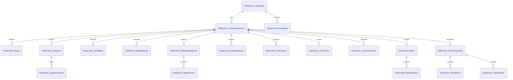

# Safety Vote Phase 0 — Logical Schema

Contract: `2026-10-08-safety-vote-phase0-r1`

Status: logical design only. This file is not a migration and must not be executed.

## 1. Conventions

- MySQL/InnoDB and `utf8mb4`.
- Primary keys are `BIGINT` unless a referenced Master table requires another type.
- Employee references use the existing `Employees.EmployeeID` representation; Phase 1 must confirm exact length and collation before writing DDL.
- All mutable configuration rows use `RowVersion`, `CreatedAt`, `CreatedBy`, `UpdatedAt`, and `UpdatedBy`.
- Date/time values are persisted as unambiguous instants. UI and schedules use `Asia/Bangkok`.
- JSON columns below are bounded configuration/metadata only. Canonical relational rows own questions, choices, ballots and results.
- Destructive cascade from Campaign to accepted ballots/results is prohibited. Archive/void replaces hard deletion after participation begins.

## 2. Relationship overview

## 3. Foundation tables

### `SafetyVote_Settings`

Module settings only; no secrets.

| Field | Purpose |
| --- | --- |
| `SettingKey` | Primary key |
| `SettingValue` | Bounded value/JSON |
| `UpdatedBy`, `UpdatedAt` | Audit metadata |

Initial keys proposed for Phase 1: `contract_version`, `schema_version`, `module_enabled=0`, `default_timezone=Asia/Bangkok`, `default_privacy_threshold=5`, `max_upload_bytes`, `allowed_image_types`.

### `SafetyVote_Campaigns`

Stable identity and lifecycle; versioned configuration lives elsewhere.

| Field | Rule |
| --- | --- |
| `id` | Primary key |
| `CampaignCode` | Unique human-readable code |
| `CurrentVersionID` | Nullable until first Draft version; validated reference |
| `Status` | Lifecycle enum |
| `OwnerEmployeeID` | Master Employee reference |
| `DiscoveryMode` | `eligible_only` or `public_listing` |
| `ScheduledOpenAt`, `ScheduledCloseAt` | Nullable schedule |
| `OpenedAt`, `ClosedAt`, `CertifiedAt`, `PublishedAt`, `ArchivedAt`, `VoidedAt` | Actual lifecycle times |
| `VoidReason`, `VoidedBy` | Required when voided |
| `RowVersion` | Optimistic lock |
| standard audit columns | Actor/time |

Indexes: unique `CampaignCode`; status/schedule; owner/status.

### `SafetyVote_CampaignVersions`

Immutable after freeze.

| Field | Rule |
| --- | --- |
| `id`, `CampaignID`, `VersionNo` | Unique campaign version |
| `ContractVersion` | API/business contract |
| `TemplateKey` | Template used to initialize |
| `CampaignType` | Supported type enum |
| `PrivacyMode` | Identified/confidential/anonymous/secret |
| `TitleTh`, `TitleEn`, `Summary`, `Description`, `RulesText` | Display content with bounded lengths |
| `TimeZone` | Defaults to `Asia/Bangkok` |
| `OpenAt`, `CloseAt` | Version schedule |
| `ResultVisibility` | live/admin/close/certified/published |
| `EditPolicy` | none, until close/latest ballot, or draft before submit |
| `ScoringMethod`, `ScoringConfigJson` | Versioned deterministic scoring |
| `TieBreakRule`, `QuorumRuleJson` | Predeclared rules |
| `PrivacyThreshold` | Minimum group size for analytics |
| `AllowAbstain`, `RandomizeOptions` | Bounded flags |
| `Status` | Draft/frozen/superseded |
| `ConfigHash` | SHA-256 of canonical frozen config |
| `FrozenAt`, `FrozenBy` | Required for frozen version |
| `RowVersion` and audit columns | Concurrency/audit |

Unique: `(CampaignID, VersionNo)`.

### `SafetyVote_Stages`

Multi-stage definition.

Fields: `id`, `CampaignVersionID`, `StageKey`, `StageName`, `StageType`, `SequenceNo`, `OpenAt`, `CloseAt`, `AdvanceRuleJson`, `ResultVisibility`, `Status`, `RowVersion`, audit columns.

Unique: `(CampaignVersionID, StageKey)` and `(CampaignVersionID, SequenceNo)`.

## 4. Form, candidate and file tables

### `SafetyVote_Questions`

Fields: `id`, `CampaignVersionID`, nullable `StageID`, nullable `ParentQuestionID`, `QuestionCode`, `QuestionType`, `PromptTh`, `PromptEn`, `HelpText`, `IsRequired`, `MinSelections`, `MaxSelections`, `Weight`, `RandomizeOptions`, `AllowComment`, `ValidationJson`, `DisplayConditionJson`, `ResultVisibility`, `SortOrder`, `RowVersion`, audit columns.

Unique: `(CampaignVersionID, QuestionCode)`.

### `SafetyVote_QuestionOptions`

Fields: `id`, `QuestionID`, nullable `CandidateID`, `OptionCode`, `LabelTh`, `LabelEn`, `Description`, `ScoreValue`, `IsAbstain`, `IsActive`, `SortOrder`, `RowVersion`, audit columns.

Unique: `(QuestionID, OptionCode)`.

### `SafetyVote_Candidates`

Fields: `id`, `CampaignVersionID`, nullable `StageID`, `CandidateType` (`employee`, `team`, `manual`, `submission`), nullable `EmployeeID`, nullable `SubmissionID`, `CandidateNo`, `DisplayName`, `DepartmentIDSnapshot`, `DepartmentNameSnapshot`, `SafetyUnitIDSnapshot`, `SafetyUnitNameSnapshot`, `PositionIDSnapshot`, `PositionNameSnapshot`, `ProfileText`, `Status`, `WithdrawReason`, `SortOrder`, `RowVersion`, audit columns.

Unique candidate rules are scoped to a Campaign Version. Employee references are optional because artwork and external options may not be employees.

### `SafetyVote_Submissions`

Fields: `id`, `CampaignVersionID`, nullable `StageID`, `SubmitterEmployeeID`, `SubmissionCode`, `Title`, `Description`, `Status`, `ReviewReason`, `SubmittedAt`, `ReviewedAt`, `ReviewedBy`, `RowVersion`, audit columns.

Status: Draft, Submitted, RevisionRequested, Accepted, Rejected, Withdrawn, Finalist.

### `SafetyVote_Files`

Fields: `id`, `CampaignID`, `CampaignVersionID`, nullable `CandidateID`, nullable `SubmissionID`, nullable `QuestionID`, `FilePurpose`, `StorageClass`, `StoredName`, `OriginalName`, `MimeType`, `FileSize`, `ContentSha256`, `WidthPx`, `HeightPx`, `Status`, `UploadedBy`, `UploadedAt`, `RemovedBy`, `RemovedAt`, `RemovalReason`.

Rules:

- `StoredName` is opaque and basename-only.
- Direct web-root paths are forbidden.
- A row remains as audit evidence after logical removal.
- File delivery checks campaign discovery/eligibility/role and file purpose.

## 5. Eligibility and campaign roles

### `SafetyVote_EligibilityRules`

Draft rule definitions.

Fields: `id`, `CampaignVersionID`, `RuleGroup`, `RuleOrder`, `Effect` (`include`/`exclude`), `AttributeKey`, `Operator`, `ValuesJson`, `Reason`, `IsActive`, `RowVersion`, audit columns.

`AttributeKey` uses an allowlist; no SQL fragment is stored.

### `SafetyVote_EligibilitySnapshots`

Snapshot header.

Fields: `id`, `CampaignVersionID`, `SnapshotNo`, `Status` (`building`, `frozen`, `superseded`, `failed`), `RuleHash`, `RowsHash`, `EligibleCount`, `AccountReadyCount`, `WarningCount`, `FrozenAt`, `FrozenBy`, `Reason`, audit columns.

Unique: `(CampaignVersionID, SnapshotNo)`. Only one frozen active snapshot per version; Phase 1 DDL must implement a safe uniqueness strategy compatible with the target MySQL version.

### `SafetyVote_EligibleVoters`

Fields: `id`, `SnapshotID`, `EmployeeID`, `EmployeeNameSnapshot`, `DepartmentIDSnapshot`, `DepartmentNameSnapshot`, `SafetyUnitIDSnapshot`, `SafetyUnitNameSnapshot`, `PositionIDSnapshot`, `PositionNameSnapshot`, `RoleSnapshot`, `TeamSnapshot`, `MasterPresent`, `AccountReady`, `EligibilityState`, `InclusionSource`, `InclusionReason`, `OverrideBy`, `OverrideAt`, `OverrideReason`, `CreatedAt`.

Unique: `(SnapshotID, EmployeeID)`.

### `SafetyVote_CampaignRoles`

Fields: `id`, `CampaignVersionID`, `EmployeeID`, `CampaignRole`, nullable `StageID`, `IsActive`, `Reason`, `AssignedBy`, `AssignedAt`, `RevokedBy`, `RevokedAt`, `RowVersion`.

Roles: submitter, candidate, reviewer, jury, campaign_manager, result_viewer, certifier.

Unique active assignment strategy: `(CampaignVersionID, EmployeeID, CampaignRole, StageID)`.

## 6. Jury tables

### `SafetyVote_JuryCriteria`

Fields: `id`, `CampaignVersionID`, nullable `StageID`, `CriterionCode`, `Title`, `Description`, `MinScore`, `MaxScore`, `Weight`, `SortOrder`, `IsActive`, `RowVersion`, audit columns.

### `SafetyVote_JuryAssignments`

Fields: `id`, `CampaignVersionID`, `StageID`, `JurorEmployeeID`, nullable `CandidateID`, `AssignmentScope`, `Status`, `ConflictState`, `ConflictReason`, `SubmittedAt`, `ReopenedAt`, `ReopenedBy`, `ReopenReason`, `RowVersion`, audit columns.

### `SafetyVote_JuryScores`

Fields: `id`, `AssignmentID`, `CandidateID`, `CriterionID`, `Score`, nullable `BoundedComment`, `Status`, `SubmittedAt`, `RowVersion`, audit columns.

Unique: `(AssignmentID, CandidateID, CriterionID)`. Submitted scores are immutable unless the assignment is formally reopened with audit.

## 7. Participation and ballot separation

### `SafetyVote_Participation`

Answers whether an employee participated, never what they selected.

Fields: `id`, `CampaignID`, `CampaignVersionID`, `SnapshotID`, `EmployeeID`, `State` (`not_started`, `draft`, `submitted`, `superseded`), `AttemptCount`, `FirstStartedAt`, `SubmittedAt`, `LastActivityAt`, nullable `ReceiptCodeHash`, `CreatedAt`, `UpdatedAt`.

Unique current participation: `(CampaignVersionID, EmployeeID)`.

Secret/anonymous rules:

- no Ballot ID, random token or answer digest is stored here;
- timestamp precision exposed to Admin reports is coarsened where correlation risk exists;
- receipt proves acceptance only and cannot locate the ballot.

### `SafetyVote_Ballots`

Fields: `id`, `CampaignVersionID`, nullable `StageID`, `BallotSequence`, `PrivacyModeSnapshot`, `Status`, `SupersedesBallotID`, `SubmittedAt`, `CanonicalBallotHash`, `IdempotencyHash`, `SchemaVersion`, `CreatedAt`.

Prohibited fields: Employee ID, name, Department, IP, User Agent, Participation ID or authenticated session ID.

Unique: `(CampaignVersionID, BallotSequence)` and scoped idempotency uniqueness. Raw idempotency keys are never persisted.

### `SafetyVote_BallotIdentities`

Optional mapping only for `identified` and `confidential` campaigns.

Fields: `BallotID`, `EmployeeID`, `IdentityMode`, `CreatedAt`.

Rules:

- no row may exist for `anonymous` or `secret_ballot`;
- access requires a separate high-trust permission and is never part of ordinary result/export payloads;
- Phase 6 must add a cross-table invariant test proving the prohibition.

### `SafetyVote_BallotAnswers`

Fields: `id`, `BallotID`, `QuestionID`, nullable `OptionID`, nullable `CandidateID`, nullable `RankValue`, nullable `NumericValue`, nullable `BooleanValue`, nullable `TextValueEncrypted`, nullable `DateTimeValue`, nullable `FileID`, `AnswerOrder`, `CreatedAt`.

Rules:

- only fields valid for the frozen question type may be populated;
- free text is prohibited by default in Secret Ballot;
- no answer row stores voter scope snapshots;
- score/result values are calculated, not trusted from the client.

### `SafetyVote_RequestKeys`

Bounded replay protection for mutation APIs.

Fields: `id`, `CampaignVersionID`, `ActorEmployeeID`, `RequestKeyHash`, `Operation`, `RequestFingerprint`, `ResponseCode`, `ResponseReference`, `ExpiresAt`, `CreatedAt`.

This table must never contain ballot choices. Secret ballot submission must not store a Ballot ID in `ResponseReference` beside the Employee ID; it stores only a generic acceptance receipt reference.

## 8. Results and certification

### `SafetyVote_ResultSnapshots`

Fields: `id`, `CampaignID`, `CampaignVersionID`, `SnapshotNo`, `CalculationContract`, `EligibilitySnapshotID`, `Status`, `EligibleCount`, `ParticipationCount`, `AcceptedBallotCount`, `RejectedBallotCount`, `AbstainCount`, `QuorumState`, `TieState`, `ReconciliationState`, `InputHash`, `ResultHash`, `CalculatedAt`, `CalculatedBy`, `FrozenAt`, `FrozenBy`, audit columns.

Unique: `(CampaignVersionID, SnapshotNo)`.

### `SafetyVote_ResultRows`

Fields: `id`, `ResultSnapshotID`, nullable `StageID`, nullable `QuestionID`, nullable `OptionID`, nullable `CandidateID`, nullable `OrganizationDimension`, nullable `OrganizationValue`, `MetricKey`, `RawCount`, `Numerator`, `Denominator`, `NumericValue`, `RankNo`, `ResultState`, `MetadataJson`.

Organization dimensions are forbidden for choice/result breakdown in Secret Ballot. Participation-only aggregation must apply `PrivacyThreshold`.

### `SafetyVote_Certifications`

Fields: `id`, `ResultSnapshotID`, `CertifierEmployeeID`, `CertificationRole`, `Decision`, `Reason`, `ResultHashSnapshot`, `CertifiedAt`, `RevokedAt`, `RevokedBy`, `RevokeReason`.

Unique: `(ResultSnapshotID, CertifierEmployeeID, CertificationRole)`.

### `SafetyVote_Reports`

Fields: `id`, `ResultSnapshotID`, `ReportType`, `ReportID`, `StoredName`, `MimeType`, `FileSize`, `ContentSha256`, `GeneratedAt`, `GeneratedBy`, `Status`.

Certified report rows are immutable. A replacement produces a new report/version.

## 9. Operations tables

### `SafetyVote_Notifications`

Fields: `id`, `CampaignID`, nullable `StageID`, `EventType`, `Channel`, `RecipientEmployeeID`, `ScheduledAt`, `DispatchedAt`, `Status`, `SuppressionKey`, `AttemptCount`, `LastErrorCode`, `PayloadMetadataJson`, audit columns.

No ballot selection or free-text response is allowed in notification metadata. Unique `SuppressionKey` prevents duplicate reminders.

### `SafetyVote_AuditLogs`

Fields: `id`, `CampaignID`, nullable `CampaignVersionID`, `ActorEmployeeID`, `ActorRole`, `Action`, `TargetType`, `TargetID`, `StatusCode`, `ReasonCode`, `BoundedDetail`, `MetadataJson`, `IPAddress`, `UserAgent`, `OccurredAt`.

The module may additionally emit a bounded event to the shared `Admin_AuditLogs`, but ballot content and Secret correlation values are prohibited in both locations.

## 10. Migration grouping

This is a plan, not authorization to create migrations.

- Phase 1 migration: Settings, Campaigns, CampaignVersions, Stages, Files, EligibilityRules, EligibilitySnapshots, EligibleVoters, CampaignRoles, module Audit and permissions.
- Phase 2 migration: Questions, Options, Candidates, Participation, Ballots, BallotAnswers, optional identified/confidential identity mapping and RequestKeys.
- Phase 3 migration: Submissions and any new answer/file indexes.
- Phase 4 migration: JuryCriteria, JuryAssignments and JuryScores.
- Phase 5 migration: ResultSnapshots, ResultRows, Certifications, Reports and Notifications.
- Phase 6 migration: only Secret Election hardening constraints/indexes proven necessary by the threat review; do not duplicate ballot storage.

Every migration must have a data-preserving rollback statement or an explicit declaration that rollback retains additive data. Migration tests run twice against guarded disposable databases and prove no unrelated table mutation.
